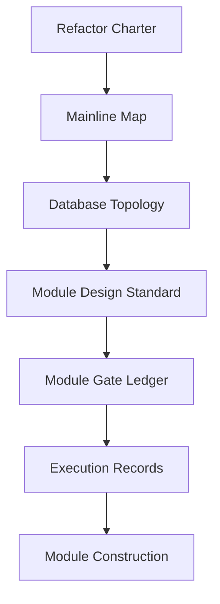

# Asteria 文档入口

本目录是 Asteria 星脉系统重构的文档主入口。



## 文件分层

| 目录 | 职责 |
|---|---|
| `00-governance` | 重构总纲、施工纪律、上线门禁 |
| `01-architecture` | 主线模块图、数据库拓扑、跨模块依赖 |
| `02-modules` | 单模块权威设计与设计模板 |
| `03-refactor` | 当前施工状态、门禁账本、执行顺序 |
| `04-execution` | 执行四件套、证据索引、结论索引 |

## 外部权威锚点

MALF 权威定义包位于：

```text
H:\Asteria-Validated\MALF_Three_Part_Design_Set_v1_2
H:\Asteria-Validated\MALF_Three_Part_Design_Set_v1_4
```

其中：

| 文件 | 职责 |
|---|---|
| `MALF_00_Three_Documents_Bridge_v1_4.md` | v1.4 包入口、版本关系与治理边界 |
| `MALF_01_Core_Definitions_Theorems_v1_4.md` | 继承 v1.3 的 Core 结构定义与定理 |
| `MALF_01B_Core_Operational_Boundary_Rules_v1_4.md` | v1.4 新增 Core 操作边界规则 |
| `MALF_02_Lifespan_Stats_Definitions_Theorems_v1_4.md` | 继承 v1.3 的波段统计学定义与 birth descriptors |
| `MALF_03_System_Service_Interface_v1_4.md` | 继承 v1.3 的 MALF 只读服务接口 |
| `MALF_07_Definition_Theorem_Review_and_Implementation_Delta_v1_4.md` | 继承 v1.3 评审结论，并由 01B 补足工程边界 |

v1.4 是当前 MALF 语义与 Core 操作边界权威包；当前 runtime formal evidence 已更新到
`malf-v1-4-core-runtime-sync-implementation-20260505-01`。该证据只覆盖 day runtime，
不声明 week/month proof、full build 或下游施工已打开。

Validated 资产清单：

- [Asteria Validated 资产清单](H:/Asteria/docs/01-architecture/02-validated-asset-inventory-v1.md)

当前重要文档/代码快照：

```text
H:\Asteria-Validated\Asteria-docs-code-20260428-214427.zip
```

该 zip 是快照锚点；快照之后的仓库更新以执行记录、closeout、manifest 和后续
Validated 归档为准。

深度研究报告：

```text
H:\Asteria-Validated\Asteria-deep-research-report-重构系统最新剖切面研究报告-20260428.md
H:\Asteria-Validated\Asteria-deep-research-report-重构系统最新剖切面研究报告-20260428.docx
H:\Asteria-Validated\Asteria-deep-research-report-重构系统最新剖切面研究报告-20260428.pdf
```

执行结论索引：

- [Asteria 执行结论索引](H:/Asteria/docs/04-execution/00-conclusion-index-v1.md)

当前 release closeout 状态为 `final-release-closeout-card` passed / v1 complete，
live next 仍为 `none / terminal`。post-terminal 路线图只作为独立研究/重构规划入口，
不得改写 live gate truth：

- [v1 使用验证路线图](H:/Asteria/docs/03-refactor/05-asteria-v1-usage-validation-roadmap-v1.md)
- [核心模块恢复与证明路线图](H:/Asteria/docs/03-refactor/06-asteria-core-module-recovery-and-proof-roadmap-v1.md)
- [v2 核心系统再重构路线图](H:/Asteria/docs/03-refactor/09-asteria-v2-core-system-reconstruction-roadmap-v1.md)

前辈系统资产清单：

- [前辈系统主线模块资产清单](H:/Asteria/docs/01-architecture/03-predecessor-system-module-inventory-v1.md)

历史总账与增量构建协议：

- [历史总账与增量构建协议](H:/Asteria/docs/01-architecture/04-historical-ledger-incremental-protocol-v1.md)

重构来路：

- [Asteria 重构来路与决策链](H:/Asteria/docs/00-governance/01-asteria-refactor-origin-trace-v1.md)

当前系统清单：

- [Asteria 当前系统清单](H:/Asteria/docs/00-governance/02-current-system-inventory-v1.md)

主线模块完成度缺口审计：

- [Asteria 主线模块完成度缺口审计](H:/Asteria/docs/00-governance/05-mainline-module-completion-gap-audit-v1.md)
